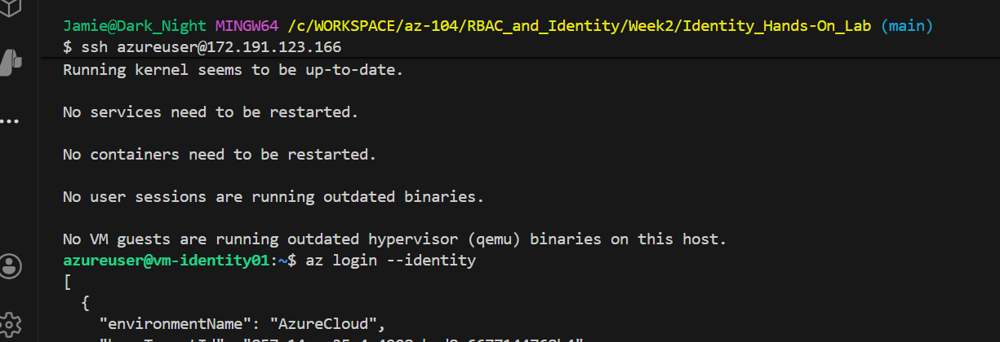
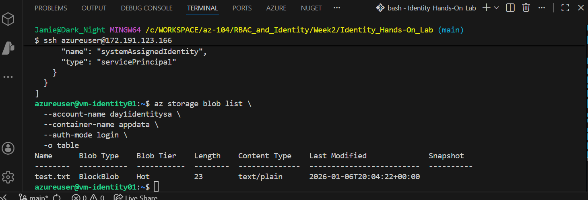

# Azure Identity & Storage Access Lab

## Lab Overview
This hands-on lab demonstrates Azure Managed Identity and Azure Storage RBAC integration. You'll learn how to configure a virtual machine with system-assigned managed identity and grant it access to Azure Blob Storage without using storage account keys.

## Prerequisites
- Azure subscription
- Azure CLI installed and configured
- Basic knowledge of Azure VMs and Storage Accounts

## Lab Architecture
- **Resource Group**: `rg-day1-identity`
- **Storage Account**: `day1identitysa`
- **Container**: `appdata`
- **Virtual Machine**: `vm-identity01` (Ubuntu 22.04)
- **Subscription ID**: `<YOUR OWN SUBSCRIPTION>`



---

## Part 1: Environment Setup

### Step 1: Create Resource Group
```bash
az group create \
  --name rg-day1-identity \
  --location eastus
```

### Step 2: Create Storage Account
```bash
az storage account create \
  --name day1identitysa \
  --resource-group rg-day1-identity \
  --location eastus \
  --sku Standard_LRS \
  --kind StorageV2
```

### Step 3: Create Blob Container
```bash
az storage container create \
  --name appdata \
  --account-name day1identitysa \
  --auth-mode key
```

### Step 4: Create Virtual Machine with Managed Identity
```bash
az vm create \
  --resource-group rg-day1-identity \
  --name vm-identity01 \
  --image Ubuntu2204 \
  --size Standard_B1s \
  --admin-username azureuser \
  --generate-ssh-keys \
  --assign-identity
```

**Note**: The `--assign-identity` flag enables system-assigned managed identity on the VM.

---

## Part 2: Azure Storage Access - User Authentication

### Step 5: Set Default Subscription
Before working with RBAC, ensure your Azure CLI session has a subscription context:

```bash
az account set --subscription b2dd5abd-3642-48b8-929e-2cafb8b4257d
```

### Step 6: Upload Test File Using Storage Account Key
Create a test file:
```bash
echo "Hello from Azure Storage" > test.txt
```

Upload using storage account key authentication:
```bash
az storage blob upload \
  --account-name day1identitysa \
  --container-name appdata \
  --name test.txt \
  --file ./test.txt \
  --auth-mode key
```

**What happens**: The Azure CLI automatically retrieves the storage account key if you have Contributor/Owner permissions on the storage account.

### Step 7: Attempt RBAC-based Access (Expected to Fail)
Try uploading with Azure AD authentication:
```bash
az storage blob upload \
  --account-name day1identitysa \
  --container-name appdata \
  --name test.txt \
  --file ./test.txt \
  --auth-mode login
```

**Expected Result**: ❌ Permission denied error
```
You do not have the required permissions needed to perform this operation.
Depending on your operation, you may need to be assigned one of the following roles:
    "Storage Blob Data Owner"
    "Storage Blob Data Contributor"
    "Storage Blob Data Reader"
```

### Step 8: Verify Upload Success
List blobs using key authentication:
```bash
az storage blob list \
  --account-name day1identitysa \
  --container-name appdata \
  --auth-mode key \
  -o table
```

---

## Part 3: Configure Managed Identity RBAC

### Step 9: Retrieve VM Managed Identity
Get the principal ID of the VM's managed identity:
```bash
az vm show \
  --resource-group rg-day1-identity \
  --name vm-identity01 \
  --query identity
```

**Sample Output**:
```json
{
  "principalId": "xxxxxxxx-xxxx-xxxx-xxxx-xxxxxxxxxxxx",
  "tenantId": "xxxxxxxx-xxxx-xxxx-xxxx-xxxxxxxxxxxx",
  "type": "SystemAssigned"
}
```

### Step 10: Assign RBAC Role to Managed Identity



#### Important: Handling Subscription Context Issues
If you encounter `MissingSubscription` errors, it indicates the Azure CLI doesn't have a subscription context. This can happen even after setting the subscription.

**Troubleshooting Steps**:
```bash
# Check current login status
az account show

# If needed, re-login
az login

# Set subscription again
az account set --subscription < YOUR OWN SUBSCRIPTION >

# Verify subscription is set
az account show --query "{Name:name, SubscriptionId:id}" -o table
```

#### Assign the Role
```bash
az role assignment create \
  --role "Storage Blob Data Contributor" \
  --assignee xxxxxxxx-xxxx-xxxx-xxxx-xxxxxxxxxxxx \
  --scope "/subscriptions/<YOUR OWN SUBSCRIPTION>/resourceGroups/rg-day1-identity/providers/Microsoft.Storage/storageAccounts/day1identitysa"
```

**Alternative**: Use Azure Portal if CLI issues persist:
1. Navigate to Storage Account → Access Control (IAM)
2. Click "Add role assignment"
3. Select "Storage Blob Data Contributor"
4. Assign to the VM's managed identity

### Step 11: Verify Role Assignment
```bash
az role assignment list \
  --assignee xxxxxxxx-xxxx-xxxx-xxxx-xxxxxxxxxxxx \
  --all \
  -o table
```

---

## Part 4: Test Managed Identity from VM

### Step 12: SSH into the VM
Get the VM's public IP:
```bash
az vm list-ip-addresses \
  --resource-group rg-day1-identity \
  --name vm-identity01 \
  --query "[].virtualMachine.network.publicIpAddresses[0].ipAddress" -o tsv
```

SSH to the VM:
```bash
ssh azureuser@<public-ip>
```

### Step 13: Test Managed Identity Access (Method 1 - curl)

Inside the VM, use the Azure Instance Metadata Service (IMDS) to get an access token:

```bash
# Request access token from IMDS
TOKEN=$(curl -s 'http://169.254.169.254/metadata/identity/oauth2/token?api-version=2018-02-01&resource=https://storage.azure.com/' -H Metadata:true | grep -o '"access_token":"[^"]*' | cut -d'"' -f4)

# Display token (truncated)
echo ${TOKEN:0:50}...

# List blobs using the managed identity token
curl -H "Authorization: Bearer $TOKEN" \
  -H "x-ms-version: 2021-08-06" \
  "https://day1identitysa.blob.core.windows.net/appdata?restype=container&comp=list"
```

**Expected Result**: ✅ XML response with blob listing (if RBAC is properly configured)

### Step 14: Test Managed Identity Access (Method 2 - Azure CLI)

Install Azure CLI on the VM:
```bash
curl -sL https://aka.ms/InstallAzureCLIDeb | sudo bash
```

Login using managed identity:
```bash
az login --identity
```

Test storage access:
```bash
# List blobs
az storage blob list \
  --account-name day1identitysa \
  --container-name appdata \
  --auth-mode login \
  -o table

# Upload a test file from the VM
echo "Testing from VM with Managed Identity" > vm-test.txt
az storage blob upload \
  --account-name day1identitysa \
  --container-name appdata \
  --name vm-test.txt \
  --file vm-test.txt \
  --auth-mode login
```

---

## Part 5: Cleanup

### Step 15: Delete Resource Group
```bash
az group delete \
  --name rg-day1-identity \
  --yes \
  --no-wait
```

---

## Key Concepts Learned

### 1. **Managed Identity**
- Eliminates the need to manage credentials in code
- Automatically managed by Azure AD
- Two types: System-assigned (lifecycle tied to resource) and User-assigned (independent)

### 2. **Azure Storage Authentication Methods**

| Method | Authentication | Use Case |
|--------|---------------|----------|
| Storage Account Key | Shared key | Full access, not recommended for production |
| Shared Access Signature (SAS) | Token with limited permissions | Temporary delegated access |
| Azure AD (RBAC) | Identity-based | Recommended for security and auditing |

### 3. **Storage RBAC Roles**

| Role | Permissions |
|------|-------------|
| Storage Blob Data Owner | Full control (read, write, delete, manage ACLs) |
| Storage Blob Data Contributor | Read, write, delete blobs |
| Storage Blob Data Reader | Read-only access to blobs |

### 4. **Azure Instance Metadata Service (IMDS)**
- Available at `http://169.254.169.254/metadata/identity/oauth2/token`
- Provides access tokens for managed identities
- Only accessible from within Azure VMs

---

## Common Issues & Troubleshooting

### Issue 1: "MissingSubscription" Error
**Symptoms**: All Azure CLI commands fail with subscription errors

**Solutions**:
```bash
# Check login status
az account show

# Re-login
az login

# Set subscription
az account set --subscription <subscription-id>
```

### Issue 2: "unrecognized arguments: -auth-mode"
**Cause**: Single dash instead of double dash

**Solution**: Use `--auth-mode` (two dashes)

### Issue 3: Permission Denied on Storage Access
**Cause**: Missing RBAC role assignment

**Solution**: 
- Verify role assignment exists
- Wait 1-2 minutes for role propagation
- Check if correct principal ID was used

### Issue 4: Cannot SSH to VM
**Cause**: Using private IP instead of public IP

**Solution**:
```bash
az vm list-ip-addresses \
  --resource-group rg-day1-identity \
  --name vm-identity01 \
  --output table
```

---

## Additional Resources

- [Azure Managed Identities Documentation](https://docs.microsoft.com/azure/active-directory/managed-identities-azure-resources/)
- [Azure Storage Authorization with Azure AD](https://docs.microsoft.com/azure/storage/common/storage-auth-aad)
- [Azure RBAC Built-in Roles](https://docs.microsoft.com/azure/role-based-access-control/built-in-roles)
- [Azure Instance Metadata Service](https://docs.microsoft.com/azure/virtual-machines/instance-metadata-service)

---

## Lab Summary

In this lab, you:
1. ✅ Created Azure resources (Storage Account, VM)
2. ✅ Enabled system-assigned managed identity on a VM
3. ✅ Configured RBAC for storage access
4. ✅ Tested storage access using storage account keys
5. ✅ Tested managed identity authentication from the VM
6. ✅ Understood the difference between key-based and identity-based authentication

**Best Practice**: Always use managed identities and RBAC instead of storage account keys in production environments for better security and audit trails.
